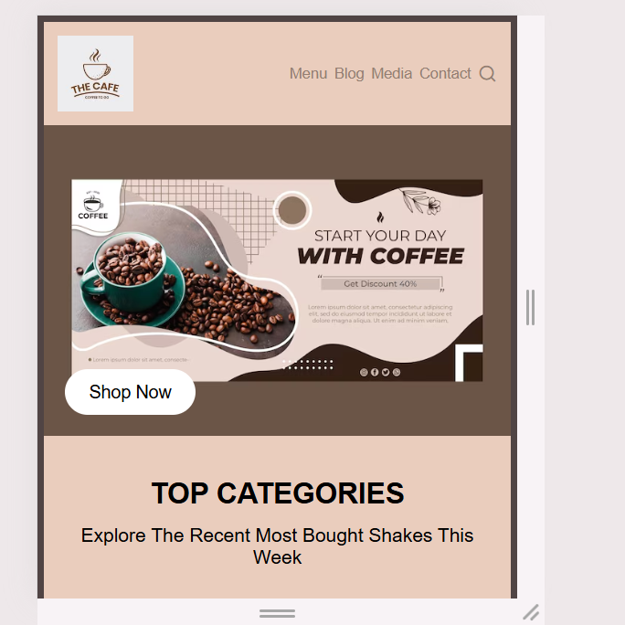
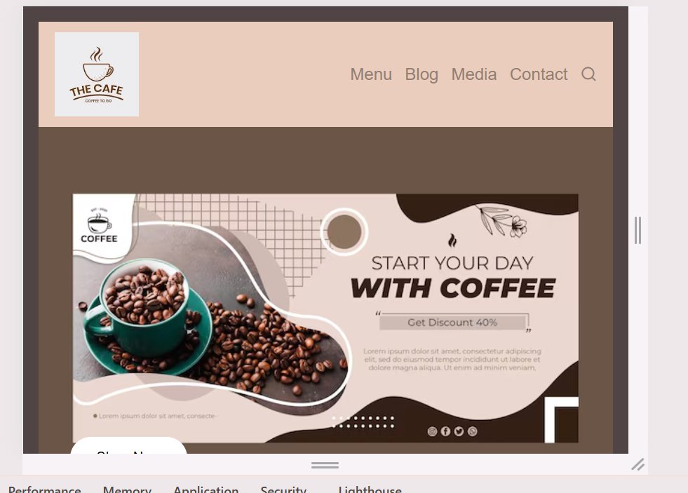
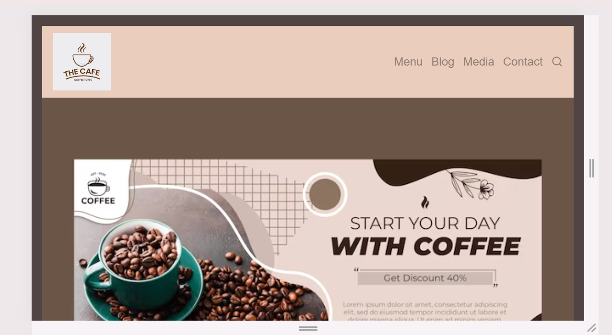
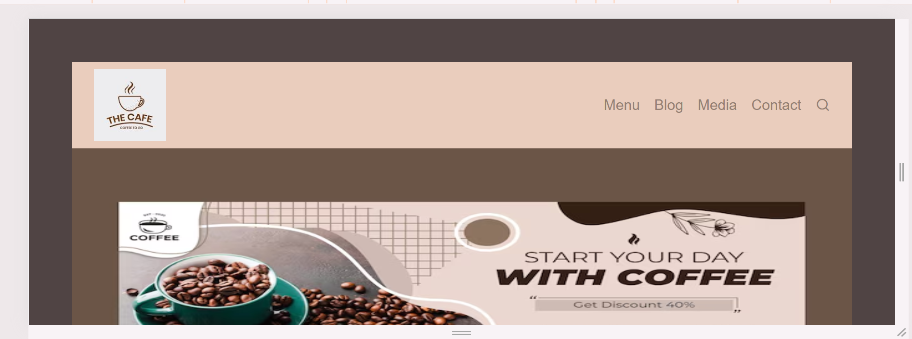

# ☕ COFFEE HOME PAGE

A responsive and attractive **Coffee Home Page** created using **HTML5 and CSS3**.

## 📌 About The Project

This project is a coffee-themed website that includes:

* Navigation Bar
* Coffee Banner Section
* Top Categories
* Top Milk Shakes
* Latest Blogs
* Footer Section
* Social Media Icons
* Responsive Design

## 🛠️ Technologies Used

* HTML5
* CSS3
* Remix Icon
* Responsive CSS

## 📂 Project Structure

```text
COFFEE-HOME-PAGE/
│
├── index.html
│
├── css/
│   ├── style.css
│   └── media.css
│
└── assets/
    └── images/
        ├── logo.png
        ├── banner.png
        ├── cofee-mocha.png
        ├── espresso americano.png
        ├── cappuccino.png
        ├── m1.png
        ├── m2.png
        ├── m3.png
        ├── blog1.png
        ├── blog2.png
        └── blog3.png
```

## ✨ Features

### 🧭 Navigation

* Logo
* Menu
* Blog
* Media
* Contact
* Search Icon

### ☕ Coffee Categories

* Coffee Mocha
* Espresso Americano
* Cappuccino

### 🥤 Top Milk Shakes

* Mocha Shake
* Lavender Shake
* Caramel Shake
* Like counter
* Product price

### 📝 Latest Blogs

Three coffee-related blog cards with images and descriptions.

### 🔗 Footer

Includes:

* Products
* Categories
* Company Information
* Social Media Links

## 📱 Responsive Design

The website is designed to work on:

* 💻 Desktop
* 📱 Mobile
* 📟 Tablet

Responsive styles are added in:

```text
css/media.css
```

## 🎨 Preview

## 📸 Project Screenshot






## 🚀 How To Run

1. Download or clone this repository.
2. Open the project folder in **VS Code**.
3. Open `index.html`.
4. Run it using **Live Server**.

## 👨‍💻 Author

**Jaymit Parmar**

---

⭐ If you like this project, don't forget to star the repository!
